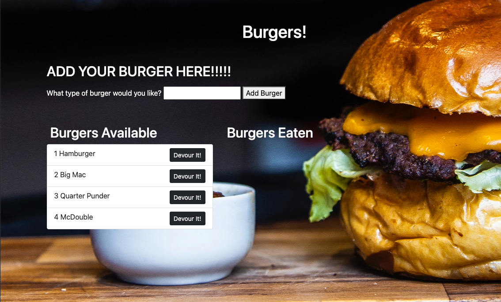

# Eat Da Burger 
  

## Table of Contents 
- [Eat Da Burger](#eat-da-burger)
  - [Table of Contents](#table-of-contents)
  - [Description](#description)
  - [Installation Instructions](#installation-instructions)
  - [Usage](#usage)
  - [Licensing](#licensing)
  - [Contributing](#contributing)
  - [Tests Code](#tests-code)
  - [Pictures and Video](#pictures-and-video)
  - [Access to Functional Applicaton](#access-to-functional-applicaton)
  - [Questions](#questions)
    
## Description
    This application was created to be a simple application that showcases the use of restful APIs in connection with mySQL.  The application allows you to enter the name of a burger.  Once entered it is added to a list of burgers available to be eaten.  Each burger added to the list has a devour it button.  Once clicked the burger will move to the eaten burgers column.
    
## Installation Instructions 
    The application is live on heroku and can be run using the heroku link.  There are no other installation instrucitons.

## Usage
    To use enter the name of a burger in the input box and hit the add burger button.  Burgers that are eaten should have the Devour it button hit so that it moves to the Burgers Eaten column.
    
## Licensing
      

    
## Contributing
    All contributions to improve the application are welcome.
    
## Tests Code
    Testing can be performed by using the application.  Burgers added should appear on the Burgers Available column witha Devour It button.  When the button is hit the burger should move to the Burgers Eaten column and the button should no longer be visible.

## Pictures and Video
Please find screenshots and a brief video showcasing the application below

## Access to Functional Applicaton

A functioning version of the application can be found here [Heroku](https://bthburgerapp.herokuapp.com)
    
## Questions
    
You can find me here on [GitHub](http://github.com/daze77), or contact me via [email](mailto:daze77@gmail.com)  
    